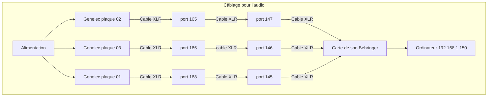

# Luminatura audio

## Liste de logiciels

* Reaper
* Puredata
* Plugdata
* Surge xt
* Tx16Wx

## Liste de VST

* Reverbate
* Delay
* Pitch
* EQ
* Playback rate
* Inverse

## Inventaire sonore

### Effets sonores de la plaque 1
* Magie
* Ruisseau
* Sons aléatoire
  * Grenouille-01
  * Cloche
  * Hibou

| Sons     | Note midi |
| -------- | --------- |
| Magie | 60  |
| Ruisseau | 62  |
| Grenouille-01 | 64  |
| Cloche | 65   |
| Hibou | 67  |

 ### Effets sonores de la plaque 2
 
* Tambour
* Méditation
* Sons aléatoire
  * Vent
  * Feuilles
  * Grenouille-01

| Sons     | Note midi |
| -------- | --------- |
| Tambour | 60  |
| Méditation | 62  |
| Grenouille-01 | 64  |
| Feuilles | 65   |
| Vent | 67  |

### Effets sonores de la plaque 3

* Magie 02
* Oiseaux
* Sons aléatoire
    * Grenouille-01
    * Libellule
    * Grenouille-02

| Sons     | Note midi |
| -------- | --------- |
| Magie-02 | 60  |
| Oiseaux | 62  |
| Grenouille-02 | 64  |
| Libellule | 65   |
| Grenouille-01 | 67  |

### Effets sonores de gouttes d'eau pour les 3 plaques

| Sons     | Note midi |
| -------- | --------- |
| Goutte-03 | 72  |
| Goutte-04 | 74  |
| Goutte-05 | 76  |
| Goutte-06 | 77   |

### Connection des haut-parleurs pour les 3 plaques

| Haut-parleurs     | Carte de son (sortie) |
| ----------------- | --------------------- |
| Genelec plaque 01 | 05                    |
| Genelec plaque 02 | 06                    |
| Genelec plaque 03 | 03                    |

